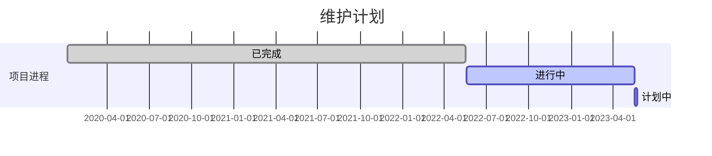

## 工作站网络中控模板
---
模板内置了内网基本需要的页面 包括内网管理·远程桌面·程序管理·访问管理·及一个超级计算机管理页面 仅包含前端代码 如有需要请自己对接后端的代码 支持php·Javaweb等程序代码 

**注意！！本代码需要在服务上运行，本地运行不能获取后端**

>>本模板来源于**kitadmin** 及**Layui2.0**
>
>  当前版本是基于layui 2.x重构的版本，与之后1.x版本有本质有区别。
> 
> 该版本的核心是[路由]，不再支持[iframe]方式的加载
> 
> 版本特性：
> 
> 1、用法一如既往的简单，快捷。(只需要简单的配置就实现一些功能). 2、提供本地开发环境。(依赖nodejs运行环境和gulp)
> 3、提供代码功能。(依赖nodejs运行环境和gulp) 4、模块化加载。(依赖layui模块化，用法与layui保持一致)
> 5、提供路由功能。(路由是本版本的核心功能了，需与模板绑定，详情请参考相关文档)
> 6、完全的前后端分离开发。(集成mockjs用于拦截请求并返回模拟数据，详情请参考相关文档)
> 7、左侧菜单重写，支持到4级菜单。(集成mockjs用于拦截请求并返回模拟数据，详情请参考相关文档)
服务内置了
**Layui2.0** · **mock.js**  **Aplayer.js**  **Dplayer.js** **Viewer.js** **Layer.js** **jQuery.js**

核心是路由 请到js/index.js 中修改路由地址 目前版本的mock.js
**已经集成！！！** 请千万不要动其他代码 除非您很有把握 否则那天崩了不要来哭 其他Layer参数也可以到index.js中去改 其他的就尽量不要动 

这里面有一个PDF是用来Welcome的 在app.js中的文字介绍有链接
然后使用PDF.js来线上预览 **没有用浏览器的接口！** 所以应该就支持到Internet Explorer9+吧 不过现在微软好像干掉Internet Explorer 了吧 话又说回来 里面那个背景图我可没有版权 给客户看的就尽量不要用了吧 来源是[MasterGO](https://mastergo.com/)的欢迎图 自己去找
所以Firefox和Chrome·Edge好像都可以 
emmmmmmm...

行先这样吧 有什么自己探索一下 什么Iconfont上的图标给你下载到lib文件夹里了 该用用 
